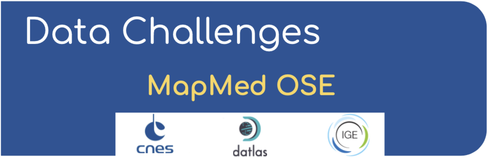
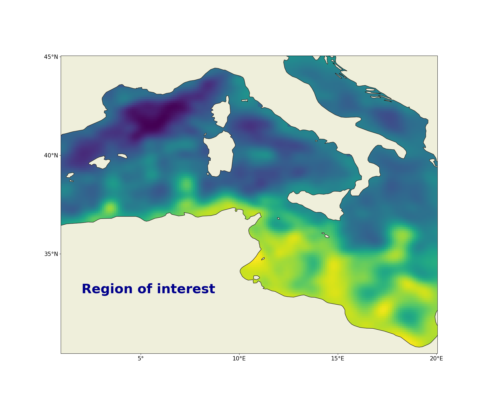

# Real SSH mapping data challenge in Western Mediterranean

This repository contains codes and sample notebooks for downloading and processing the SSH mapping data challenge.

The quickstart can be run online by clicking here:


## Motivation

The goal is to investigate how to best reconstruct sequences of Sea Surface Height (SSH) maps from partial satellite altimetry observations. This data challenge follows an _Observation System Experiment_ framework: Satellite observations are from real sea surface height data from altimeter. The region of interest in this DC is the Western Mediterrannean sea [1°E x 20°E , 30°N x 45°N].
The practical goal of the challenge is to investigate the best mapping method according to scores described below and in Jupyter notebooks. 



### Observations
The SSH observations include SARAL/Altika (alg), Haiyang-2B (h2b), Jason 3 (j3), Sentinel 3A (s3a), Sentinel 3B (s3b) and Cryosat-2 new orbit (c2n) altimeter data. This nadir altimeters constellation was operating and will be investigated during the 20210101-20210331 period. Note that for the mapping the Cryosat-2 new orbit altimeter data will not be considered in order to perform an independent assessment of the various reconstructions. 

The observations (for reconstruction and for evaluation) are hosted on the meom-opendap server available for download: see **Download the data** section below.

<p float="left">
  
    
</p>


### Data sequence and use
 
The SSH reconstructions are assessed over the period from 2021-01-15 to 2021-03-15.

For reconstruction methods that need a spin-up or training, the **observations** can be used during the 15 first and the 15 last days before and after the two-month evaluation period. Note also that any other Nadir satellite observations available outside of the evaluation period can be used and are found on the CMEMS website. 
The evaluation is performed within the geographical box: [2°E x 19°E , 31°N x 44°N] so to avoid potential boundary issues which is a topic left for an other challenge.  
The altimeter data from Cryosat-2  should never be used so that any reconstruction can be considered uncorrelated to the evaluation period.


## Leaderboard

| Method   |   µ(RMSE)  |   σ(RMSE) |   λx (km) | Notes             | Reference                |
|:---------|-----------:|----------:|----------:|:------------------|:-------------------------|
| BASELINE |   |  |   | Covariances BASELINE OI |   | 


**µ(RMSE)**: average RMSE score.  
**σ(RMSE)**: standard deviation of the RMSE score.  
**λx**: minimum spatial scale resolved.   
 
## Quick start
You can follow the quickstart guide in this notebook or launch it directly from  .

## Download the data
The data are hosted on the opendap: [ocean-data-challenges/dc_MapMed_OSE/](https://ige-meom-opendap.univ-grenoble-alpes.fr/thredds/catalog/meomopendap/extract/ocean-data-challenges/dc_MapMed_OSE/catalog.html). 
They are presented with the following directory structure:

```
. 
|-- dc_obs
|   |-- dt_med_alg_phy_l3_20210101-20210331_1-2_40-2.nc
|   |-- dt_med_h2b_phy_l3_20210101-20210331_1-2_40-2.nc
|   |-- dt_med_j3_phy_l3_20210101-20210331_1-2_40-2.nc
|   |-- dt_med_s3a_phy_l3_20210101-20210331_1-2_40-2.nc
|   |-- dt_med_s3b_phy_l3_20210101-20210331_1-2_40-2.nc 
 

|-- dc_eval
|   |-- dt_med_c2n_phy_l3_20210101-20210331_1-2_40-2.nc

```


To start out download the *observation* dataset (dc_obs, 1.6M) from the temporary data server, use:
```shell
wget https://ige-meom-opendap.univ-grenoble-alpes.fr/thredds/fileServer/meomopendap/extract/ocean-data-challenges/dc_MapMed_OSE/dc_obs.tar.gz
```

and the *evaluation* dataset (dc_eval, 320k) using:

```shell
!wget https://ige-meom-opendap.univ-grenoble-alpes.fr/thredds/fileServer/meomopendap/extract/ocean-data-challenges/dc_MapMed_OSE/dc_eval.tar.gz

```
and then uncompress the files using `tar -xvf <file>.tar.gz`. You may also use `ftp`, `rsync` or `curl`to donwload the data.

## Baseline and evaluation

### Baseline
The baseline mapping method is optimal interpolation (OI), in the spirit of the present-day standard for DUACS products provided by AVISO. OI is implemented in the [`baseline_oi`](https://github.com/ocean-data-challenges/2021a_SSH_mapping_OSE/blob/master/notebooks/baseline_oi.ipynb) Jupyter notebook. The SSH reconstructions are saved as a NetCDF file in the `results` directory. The content of this directory is git-ignored.
   
### Evaluation

The evaluation of the mapping methods is based on the comparison of the SSH reconstructions with the *independent* Cryosat-2 along-track dataset. It includes two scores, one based on the Root-Mean-Square Error (RMSE), the other based on Fourier wavenumber spectra. The evaluation notebook [`example_data_eval`](https://github.com/ocean-data-challenges/2020a_SSH_mapping_NATL60/blob/master/notebooks/example_data_eval.ipynb) implements the computation of these two scores as they could appear in the leaderboard. The notebook also provides additional, graphical diagnostics based on RMSE and spectra.

## Data processing

Cross-functional modules are gathered in the `src` directory. They include tools for regridding, plots, evaluation, writing and reading NetCDF files. The directory also contains a module that implements the baseline method.  

## Acknowledgement

The structure of this data challenge was to a large extent inspired by the second ocean-data-challenge created for the BOOST-SWOT ANR project in collaboration with the MEOM team at IGE lab, CLS and IMT Atlantic: [`2021a_SSH_mapping_OSE`](https://github.com/ocean-data-challenges/2021a_SSH_mapping_OSE).
